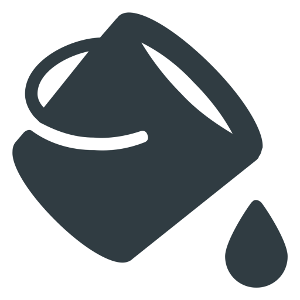
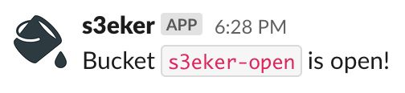
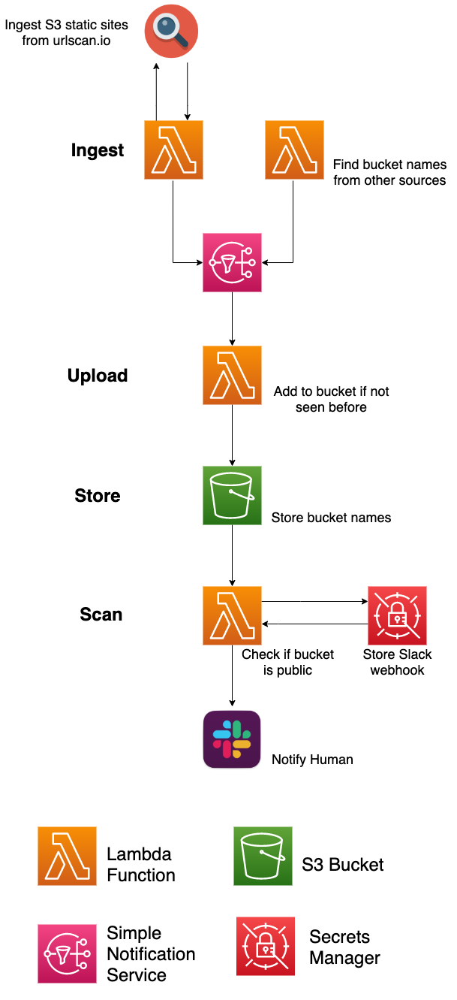

# s3eker 

s3eker is an extensible way to find open S3 buckets and notify via Slack. There are no limits on what can be used to ingest bucket names as long as it has a way to publish to the AWS SNS topic (REST API, CLI, SDK). Almost all of the infrastructure can be created using Terraform.

## Ingestion Example

A Lambda function searches [urlscan.io](https://urlscan.io) every hour for websites that reach out to a `s3-website-us-east-1.amazonaws.com` subdomain. The theory being if a bucket is being used as a static site, it may have more relaxed permissions.

## Infrastructure Overview

s3eker runs on AWS and can be spun up using Terraform with the exception of a Secrets Manager entry for the Slack webhook. No API key is needed for urlscan.io. Ingestion functions are run periodically using Cloudwatch events. They publish all found buckets to an SNS topic. This notifies the upload function which will check if the bucket has already been scanned. If it has not been scanned, the bucket name is uploaded to an S3 bucket, triggering the scan function.

